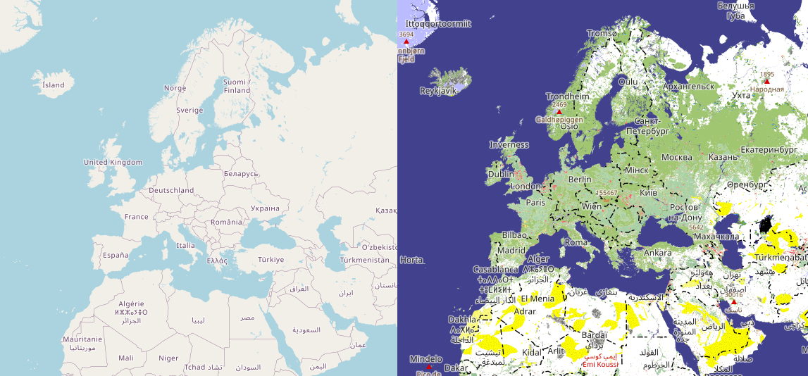
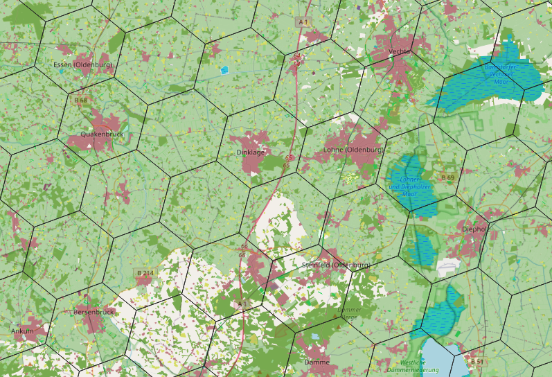
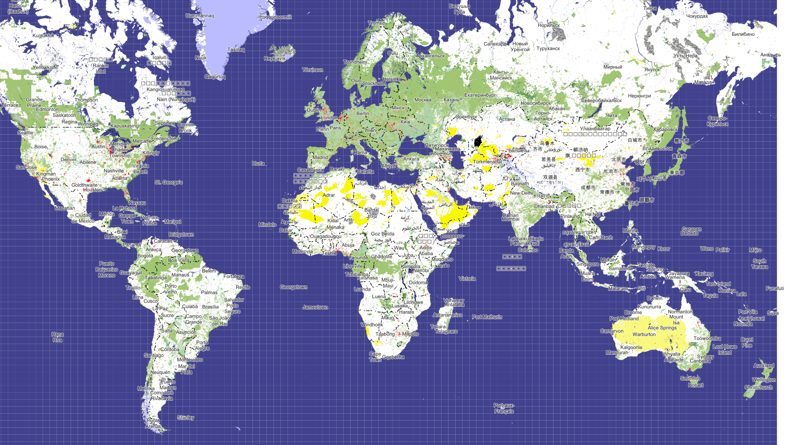

#  Generalized Landcovers aka OpenLandcoverMap ;)

This is an attempt to create properly generalized map, to see at least something on zoom levels z0-z8. It is well known that standard OSM ("mapnik" aka "opensteetmap-carto") is empty and boring on those zooms.



Currently, the online map is accessible here: 

**http://openlandcovermap.zkir.ru**

## Ideas
What can be drawn on zooms z0-z8? 
We cannot just draw existing osm polygonal features, because they are too small 
(and there are to many of them). We cannot even select polygons by size, because objects are fractional: 
they consist of lots of smaller parts.

So we need to create completely different geometry.  We will do it in a very simple way. 
We will take all the  <b>landuse= *</b> and <b>natural= *</b>’ polygons,  and match them with a hexagonal grid (‘h3’, currently of resolution 6).  For each grid cell, we identify a **single tag** which describes this sell in the best way, polygons of which occupy the maximum area in that cell.




To make the map more interesting, we will add cities and mountain peaks. _"Cartographic importance"_ should be calculated for each point, since it is impossible to select cities/mountain peaks for zooms z0-z8 based directly on population/elevation.

## Taginfo project

We have our own Taginfo project page so that the tags that are used in this map are visible . 

* https://taginfo.openstreetmap.org/projects/openlandcovermap#tags

## Installation
### Prerequisites
It is assumed that OSM data is imported into PostGis database named 'gis' via osm2pgsql, for example like this: 

```sh
osm2pgsql-bin\osm2pgsql -d gis -U test1 -W --create --slim  -G --hstore --tag-transform-script z:\home\zkir\src\openstreetmap-carto/openstreetmap-carto.lua -C 0 --flat-nodes d:\nodes.bin --number-processes 8 -S z:\home\zkir\src\openstreetmap-carto\openstreetmap-carto.style -r pbf "d:\_planet.osm\planet-231211.osm.pbf"
```

and that all the stuff necessary to render osm tiles ("opensteetmap-carto", fonts, mapnik, mod_tile, apache etc) is installed. You may start with the following manuals: 

* https://switch2osm.org/serving-tiles/manually-building-a-tile-server-ubuntu-22-04-lts/
* https://ircama.github.io/osm-carto-tutorials/tile-server-ubuntu/

### PostGIS h3 extension
h3 extension should be installed on the gis database, each time gis database is recreated.

```sql
CREATE EXTENSION h3;
CREATE EXTENSION h3_postgis CASCADE;
```
_I remember that I had to compile it from sources and install some compilers._

### Postgres user name and password
ogr2org requires both name and password even for local user, so please specify it

```sh
export PGUSER=<somedumbuser>
export PGPASSWORD=<somestrongpassword>
```
probably ~/.bashrc is a good place for that.

### Run data creation
We need to create generalized geometry, to be used for rendering. 

```sh
make
```
This will create both tables with generalized geometry in posgis (h3.* schema) and export shape files in _data_ folder.

Note: it could take significant time, e.g. several hours.

Also it should create **mapnik.xml** from  mss files, but it is not yet implemented (precompiled **mapnik.xml** is included).

### Test installation

Run 

```sh
make test
```

If all is OK, it will render map of the world to 'landcovers_test_render.png', compare it with 'landcovers_test_render_sample.png'



After that, **mapnik.xml** can be used to produce tiles. If any error occurs, you are on your own :)

## Discussion

Questions can be asked here, both in English and Russian

* https://www.openstreetmap.org/user/Zkir/diary/403070
* https://www.openstreetmap.org/user/Zkir/diary/403129

## Acknowledgements
This project is largely inspired by [gravitystorm openstreetmap-carto](https://github.com/gravitystorm/openstreetmap-carto) and many svg/png files for map features are borrowed from it.

## Author and license
This project is created by Zkir aka Kirill B. and released under [MIT License](LICENSE.md).

